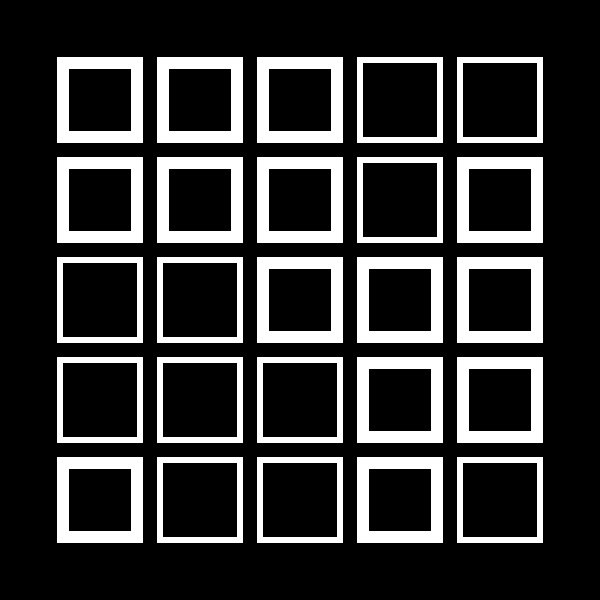
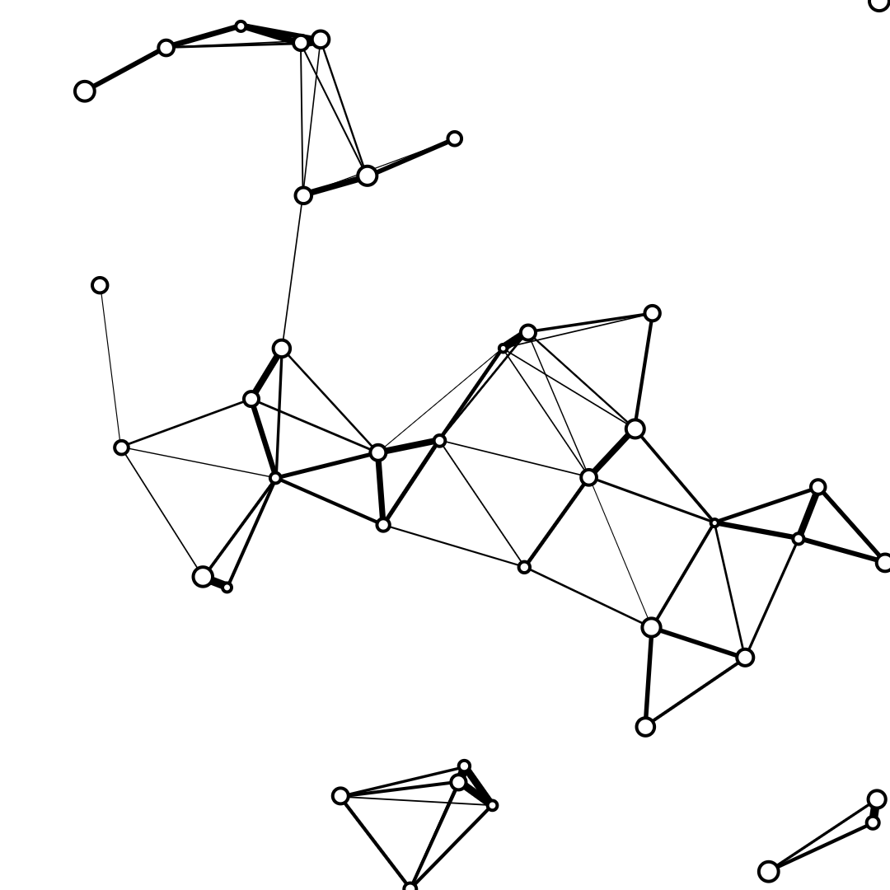
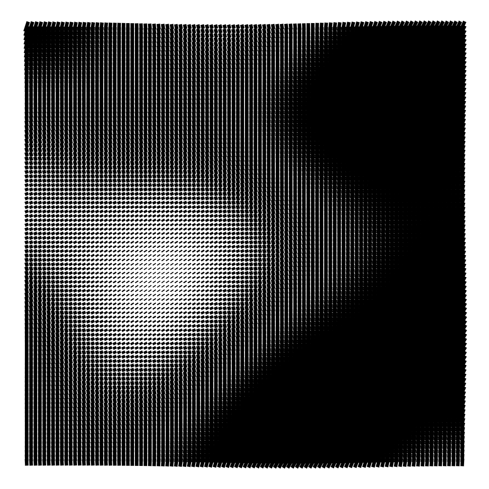
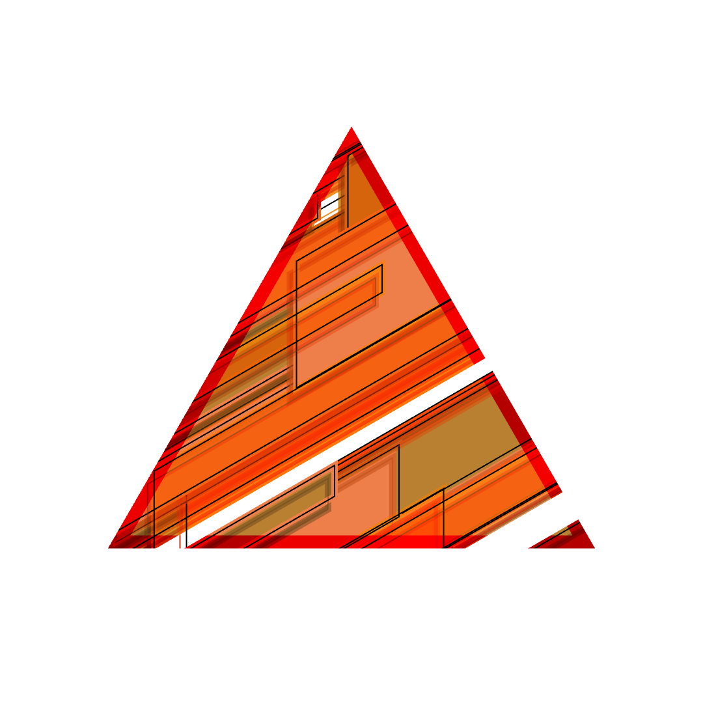

# Random Generated Sketches

You can open examples by running `npx canvas-sketch-cli sketch-01.js --open`

[Sketch 01](./sketch-01.js)

---

[Sketch 02](./sketch-02.js)

---

[Sketch 03](./sketch-03.js)

---

[Sketch 04](./sketch-04.js)

---

[Sketch 05](./sketch-05.js)

---

[Sketch 06](./sketch-06.js)

